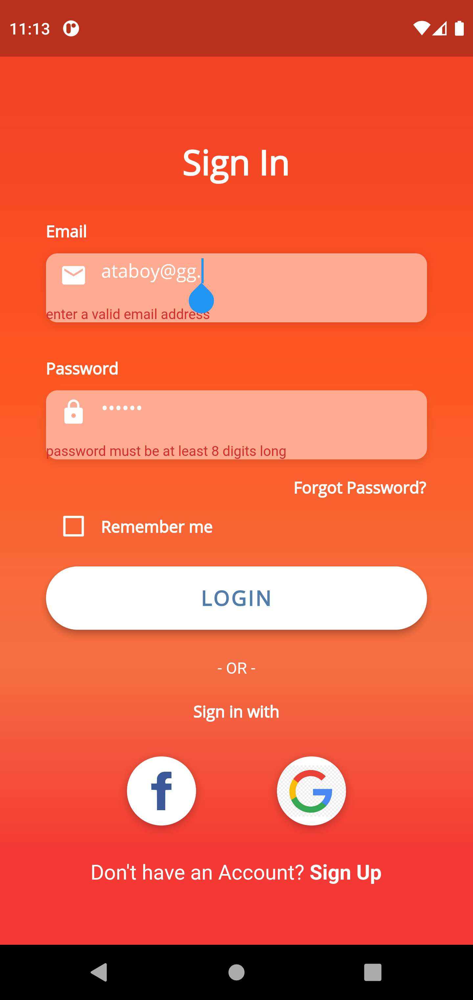
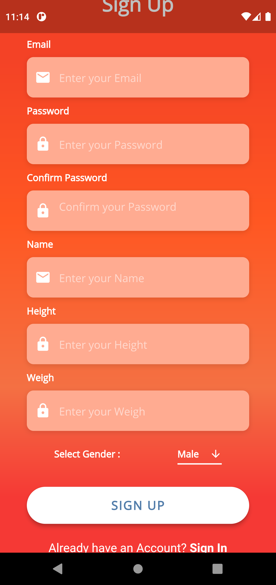
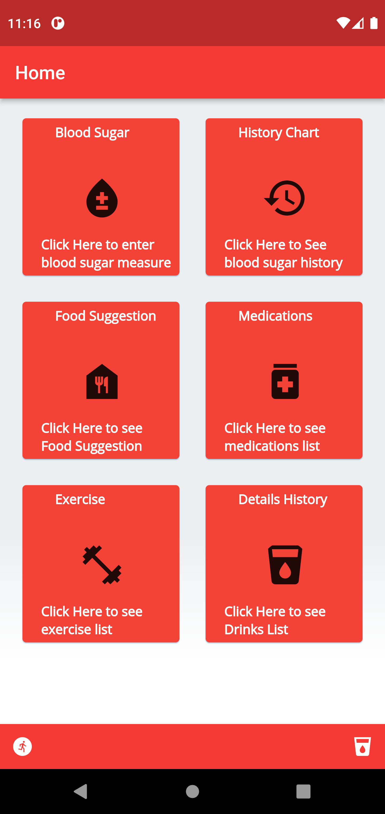
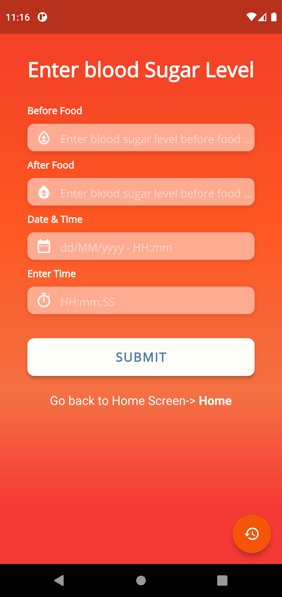
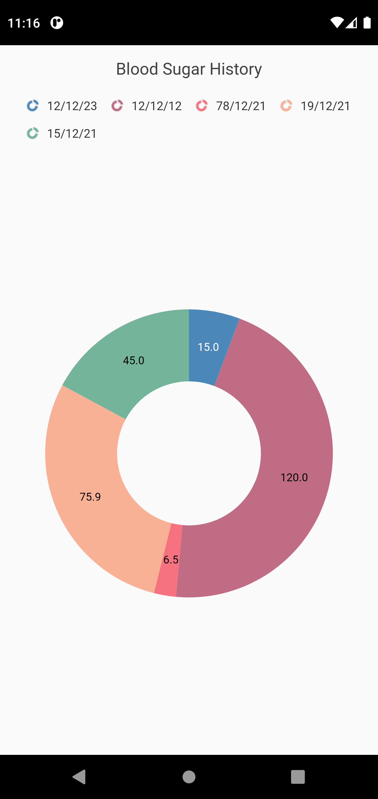
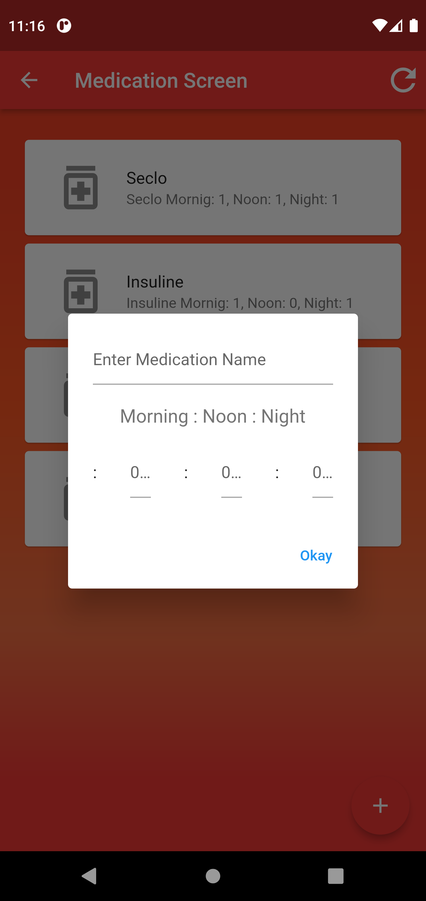
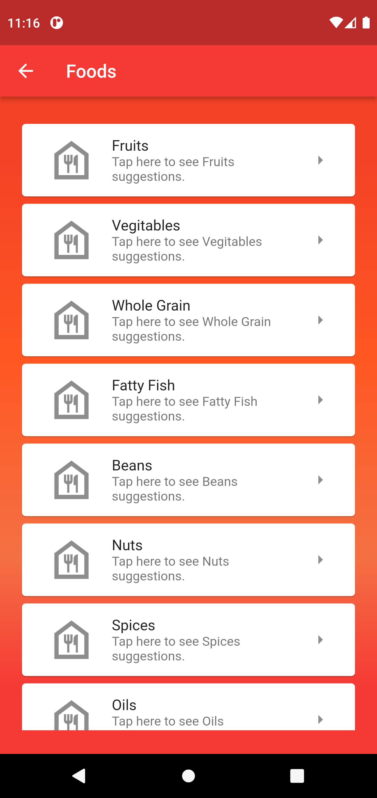
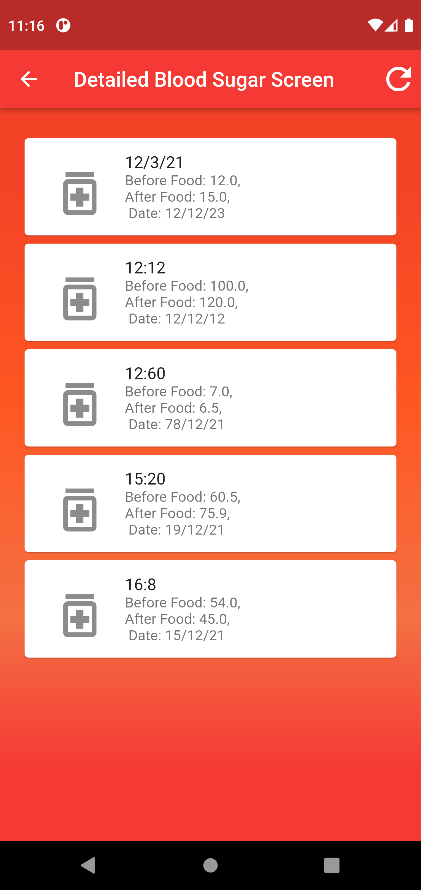
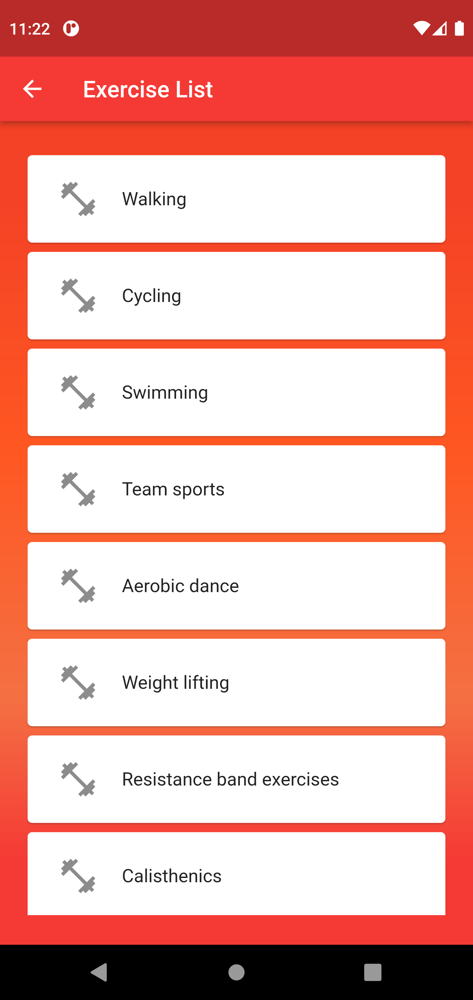

# blood_sugar_monitor

# Blood Sugar Monitor  

Flutter appps with sqflite database. 
**It has several screens and a doughnut chart diagram.**

Star⭐ the repo if you like what you see😉.

## 📸 ScreenShots

| 2 | 3 |
|------|-------|
|||

| 4 | 5 |
|------|-------|
|||

| 6 | 7 |
|------|-------|
|||

| 8 | 9 |
|------|-------|
|||

## ✨ Requirements
* Any Operating System (ie. MacOS X, Linux, Windows)
* Any IDE with Flutter SDK installed (ie. IntelliJ, Android Studio, VSCode etc)
* A little knowledge of Dart and Flutter
* A brain to think 🤓🤓

## 🤓 Author(s)
**Rudra Sarker Utsha** 

## Getting Started

This project is a starting point for database intigration to a Flutter application.

A few resources to get you started if this is your first Flutter project:

- [Lab: Write your first Flutter app](https://flutter.io/docs/get-started/codelab)
- [Cookbook: Useful Flutter samples](https://flutter.io/docs/cookbook)

For help getting started with Flutter, view our 
[online documentation](https://flutter.io/docs), which offers tutorials, 
samples, guidance on mobile development, and a full API reference.
